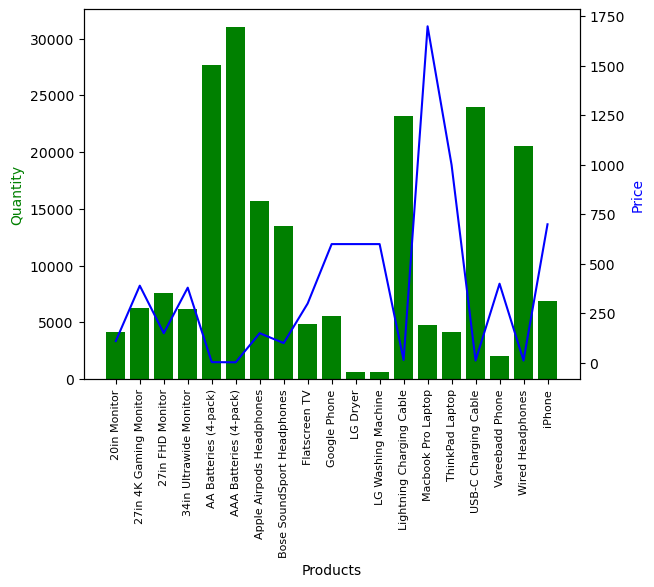

# Anual Sales Report By Python Program

## Project Overview
This project creates a Python program that automates the generation of charts for annual sales reports. In this project, the data is at a low level of detail, and the program provides an overview analysis of monthly sales throughout the year.

## Bussiness Key Questions
1. Which month has the best sales?
2. Which city has the best sales?
3. What time of day has the best sales so we can boost advertising?
4. Which products are commonly sold together?
5. Which products are selling the most?

## Data Form
The program processes CSV data files with the following column formats:  
Order ID, Product, Quantity Ordered, Price Each, Order Date, Purchase Address  

 

## Visualizations

### Sales By Month

We can see that the peak season falls in the final months of the year, with December being the highest.

### Sales By City

San Francisco is the city has the best sales.

### Sales By Hour

There are two time periods with the highest number of purchases: 11h to 13h and 18h to 20h.

### Top Products Sold Together

These are the top 10 product combinations sold together.

### Sales By Product

The chart shows the sales of each product, along with the average unit price of the product. This allows for an evaluation of the correlation between product price and sales.

